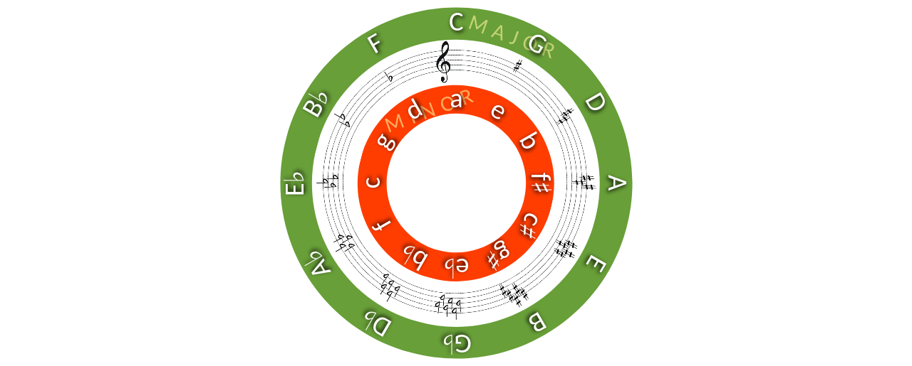

# A CIRCLE OF FIFTHS (WIP)

A web page that features an interactive version of the [Circle of Fifths](https://en.wikipedia.org/wiki/Circle_of_fifths), written to have fun with music theory and practice CSS and Javascript (and perhaps Python, later on).

---

## Features
---
Currently, features a circle with a circular staff with the key-signatures of each key, and selectable labels for both major and minor keys, (drawn entirely in CSS! see [Resources](#Resources) below) which spins to center the circle at the selected key.  
## TODO
---
- [x] Change view between full circle and half-circle depending on screen dimensions (full circle for portrait orientation and half-circle for landscape).
- [ ] Be able to spin circle by pressing arrow keys, by touch (on touchscreens), or by pressing arrow buttons.
- [ ] Change the color of a sections of the staff to the color of a selected key
- [ ] Style key label hover/select
- [ ] Add a clef that stays stable while the circle spins.
- [ ] Be able to select/move to a random key.

## References
---
+ [Circle of Fifths - Wikipedia](https://en.wikipedia.org/wiki/Circle_of_fifths)
+ [Building a Circular Navigation with CSS](https://tympanus.net/codrops/2013/08/09/building-a-circular-navigation-with-css-transforms/)

+ [Scriabin's Clavier à lumières](https://en.wikipedia.org/wiki/Clavier_%C3%A0_lumi%C3%A8res)
